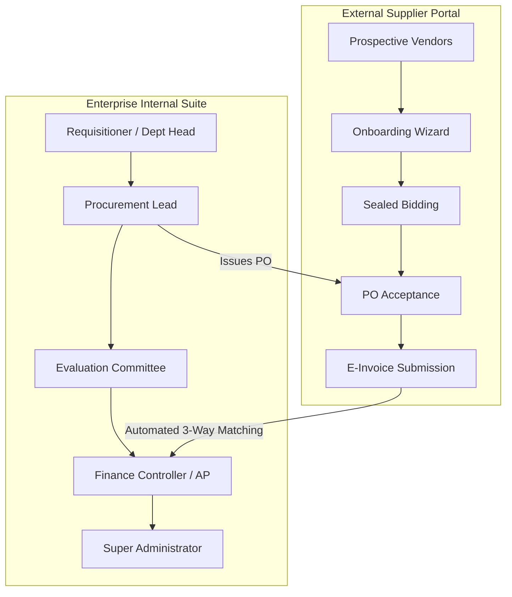
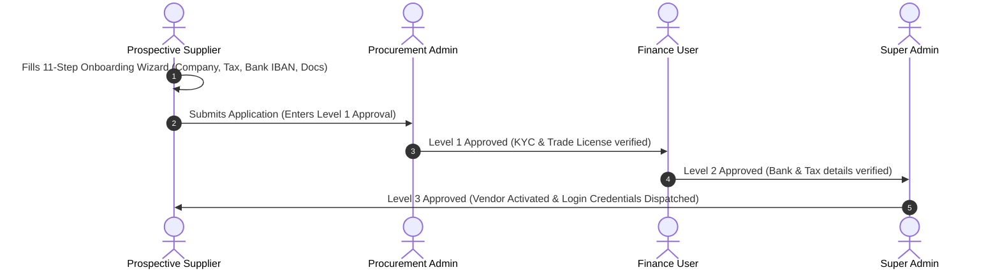

# 📖 Enterprise E-Procurement: End-to-End Process & User Guide

This guide documents the complete architectural lifecycle, business workflows, screen catalog, and role-based responsibilities of the **Enterprise E-Procurement & Supplier Portal Platform**.

---

## 📑 Table of Contents
1. [Platform Architecture & Core Concepts](#-1-platform-architecture--core-concepts)
2. [Screen-by-Screen Reference & Navigation](#-2-screen-by-screen-reference--navigation)
3. [Step-by-Step Business Process Flows (End-to-End Walkthroughs)](#-3-step-by-step-business-process-flows)
   - [Flow 1: Supplier Self-Registration & Qualification](#flow-1-supplier-self-registration--qualification)
   - [Flow 2: Purchase Requisition (PR) Creation & Approvals](#flow-2-purchase-requisition-pr-creation--approvals)
   - [Flow 3: Sourcing Event (Tender / RFQ) Creation & Vendor Bidding](#flow-3-sourcing-event-tender--rfq-creation--vendor-bidding)
   - [Flow 4: Bid Opening, Evaluation Committee & Scoring](#flow-4-bid-opening-evaluation-committee--scoring)
   - [Flow 5: Award Approval & Contract Formulation](#flow-5-award-approval--contract-formulation)
   - [Flow 6: Purchase Order (PO) Issuance & Tiered Governance](#flow-6-purchase-order-po-issuance--tiered-governance)
   - [Flow 7: Supplier PO Acceptance & Dock Goods Receipt (GRN)](#flow-7-supplier-po-acceptance--dock-goods-receipt-grn)
   - [Flow 8: E-Invoicing & Automated 3-Way Matching Engine](#flow-8-e-invoicing--automated-3-way-matching-engine)
   - [Flow 9: Payment Disbursement & Remittance](#flow-9-payment-disbursement--remittance)
4. [Central Approval Inbox & Audit Decision Trail](#-4-central-approval-inbox--audit-decision-trail)
5. [User & Access Master (Super Admin Control)](#-5-user--access-master-super-admin-control)

---

## 🏛️ 1. Platform Architecture & Core Concepts

The system is organized into two distinct security portals:

---

## 🖥️ 2. Screen-by-Screen Reference & Navigation

### 🏢 Internal Enterprise Suite Screens

| Sidebar Menu Item | Target Screen | Access Roles | Purpose & Primary Actions |
|---|---|---|---|
| **Dashboard** | `AdminDashboard` | All Internal Users | High-level KPI analytics: Total Spend, Active Sourcing Events, Open Requisitions, Matched Invoices, and quick action shortcuts. |
| **Approval Center** | `ApprovalCenter` | All Internal Approvers | Central inbox for pending approval tasks across all modules (PR, Sourcing Awards, POs, Invoices, Supplier Onboarding). Supports **Inspect**, **Approve**, **Reject**, **Request Clarification**, and **Delegate**. |
| **Suppliers Directory** | `SupplierList` | Procurement, Finance, Admin | Master list of all registered, active, pending, or blacklisted suppliers. Click any supplier to view their **360° Supplier Profile**. |
| **Scorecards** | `SupplierPerformance` | Procurement Lead, Admin | Evaluates vendors on Quality, On-Time Delivery, Price Competitiveness, Responsiveness, and Compliance (0-100% composite score). |
| **Risk & Compliance** | `SupplierRisk` | Risk Officer, Admin | Financial, Legal, Cybersecurity, and Operational risk matrices. |
| **Purchase Requests** | `PurchaseRequisitions` | Department Users, Approvers, Procurement | Internal Purchase Requisitions (PR). Employees draft requirements with line items and submit for departmental budget sign-off. |
| **RFQs, RFPs & Tenders** | `TenderManagement` | Procurement Admin, Sourcing Lead | Sourcing event creation (Open Tender, Restricted RFQ, Two-Stage Auction), technical criteria definition, bid security rules, and committee assignment. |
| **Evaluation Workspace** | `BidEvaluationWorkspace` | Evaluators, Committee Lead | Sealed bid opening, technical scoring breakdown, commercial price comparison, weighted total calculation, and winner recommendation. |
| **Award Management** | `AwardManagement` | Procurement Lead, Executive Admin | Formal Notice of Award generation, award approval tracking, and automatic transition to Legal Contract generation. |
| **Contracts** | `ContractManagement` | Contract Manager, Legal, Admin | Formal legal contracts, milestones, deliverables, SLA terms, and contract amendment tracking. |
| **Purchase Orders** | `PurchaseOrders` | Procurement Admin, Approvers | PO drafting, issuance, multi-level financial approvals, and PDF export with live delivery status. |
| **Deliveries / GRN** | `GoodsReceipts` | Warehouse Officer, Procurement | Dock shipment logging: Record accepted vs rejected item quantities upon physical delivery. Generates legal Goods Receipt Notes (GRN). |
| **Invoices & 3-Way Match** | `Invoices3WayMatch` | Accounts Payable, Finance Controller | Real-time automated 3-Way Matching audit ($PO \leftrightarrow GRN \leftrightarrow Invoice$). Re-evaluate matches and flag quantity/price variances. |
| **Disbursements** | `Payments` | Finance Director, AP | Release payments via Wire Transfer, ACH, Check, or Corporate Card against verified invoices. Dispatches automated payment remittance notifications. |
| **User & Access Master** | `UserManagementAdmin` | **Super Administrator Only** | Create internal staff or supplier logins, reset user passwords, and enable/disable login access in real time. |
| **Workflow Engine** | `WorkflowAdmin` | Super Administrator | Configure tiered multi-level approval hierarchies, role assignments, SLA hours, and monetary threshold conditions. |
| **Master Data & Settings** | `MasterDataAdmin` | Super Administrator | Manage company departments, cost centers, UNSPSC categories, auto-numbering sequences, and email templates. |
| **Reports & Analytics** | `ReportsAnalytics` | Management, Procurement, Finance | Export spend analytics, sourcing efficiency, and vendor KPIs to Excel/CSV/PDF. |
| **Tamper-Evident Audit** | `AuditLogs` | Compliance, Super Admin | Immutable audit log of every system action, user login, record creation, approval decision, and status modification. |

---

### 🌐 External Supplier Portal Screens

| Supplier Menu Item | Target Screen | Purpose & Actions |
|---|---|---|
| **Supplier Dashboard** | `SupplierDashboard` | Live summary of active opportunities, submitted bids, issued POs, and pending invoice payments. |
| **My 360 Profile** | `SupplierProfile` | Manage company legal name, banking information (IBAN/SWIFT), tax IDs, and enrolled UNSPSC categories. |
| **Opportunities & Tenders** | `Opportunities` | Discover published RFQs and public tenders. Download specifications and register intent to bid. |
| **My Sealed Bids** | `MyBids` / `TenderBidSubmit` | Submit encrypted commercial quotations and technical proposals before deadline expiry. |
| **Contracts & Milestones** | `SupplierContracts` | View active contracts, milestone delivery schedules, and payment terms. |
| **Purchase Orders** | `SupplierPOs` | Review issued purchase orders and click **"Accept PO"** to confirm fulfillment. |
| **Shipment / GRN** | `SupplierDeliveries` | View warehouse dock inspection receipts and accepted quantity logs. |
| **Invoices (3-Way Match)** | `SupplierInvoices` | Submit digital E-Invoices against accepted POs and monitor automated 3-way matching progress. |
| **Payments & Remittance** | `SupplierPayments` | View disbursed payment vouchers, wire reference numbers, and remittance receipts. |
| **Compliance & Expiry** | `SupplierDocuments` | Upload and renew business licenses, ISO certificates, and tax clearance documents. |

---

## 🔄 3. Step-by-Step Business Process Flows

### Flow 1: Supplier Self-Registration & Qualification

1. **Vendor Self-Registration**: Prospective vendor clicks *"Register as Supplier"* on the login screen and completes the responsive 11-step onboarding wizard.
2. **Level 1 (Procurement Admin - Sarah Jenkins)**: Logs in, visits `Approval Center`, inspects trade documents, and approves.
3. **Level 2 (Finance User - Rachel Greenfield)**: Inspects bank account details (IBAN/SWIFT) and tax identification number, then approves.
4. **Level 3 (Super Admin - Alexander Wright)**: Performs final executive activation sign-off.
5. **Outcome**: Supplier status updates to `Active` and the supplier can log in at `http://localhost:3000`.

---

### Flow 2: Purchase Requisition (PR) Creation & Approvals

1. **Requisition Draft**: Department user (Marcus Vance) visits `Purchase Requests` $\rightarrow$ clicks `+ Create Requisition` $\rightarrow$ enters items, estimated unit prices, delivery location, and required date.
2. **Approval Hierarchy**:
   - Level 1: **Department Head** reviews operational justification.
   - Level 2: **Finance User** checks allocated departmental budget.
   - Level 3: **Procurement Admin** reviews sourcing feasibility.
3. **Outcome**: Upon final approval, the PR status changes to `Approved`, enabling the **"Create Sourcing Event (Tender/RFQ)"** button.

---

### Flow 3: Sourcing Event (Tender / RFQ) Creation & Vendor Bidding

1. **Publish Event**: Procurement Admin (Sarah Jenkins) visits `RFQs, RFPs & Tenders` $\rightarrow$ creates sourcing event (e.g. *High-Density Server Infrastructure*) $\rightarrow$ defines item specifications, submission deadline, and technical evaluation weights (e.g., 60% Tech / 40% Commercial) $\rightarrow$ publishes event.
2. **Supplier Bid Submission**: Supplier (Saqlain Supariwala) logs in to the **Supplier Portal** $\rightarrow$ opens `Opportunities & Tenders` $\rightarrow$ clicks `Submit Sealed Bid` $\rightarrow$ fills unit price offers and delivery lead times $\rightarrow$ submits sealed bid.

---

### Flow 4: Bid Opening, Evaluation Committee & Scoring

1. **Sealed Bid Opening**: Evaluator (Dr. Elena Rostova) visits `Evaluation Workspace` $\rightarrow$ opens bids after the submission deadline.
2. **Technical & Commercial Scoring**: Committee assigns scores for each criterion (Technical Architecture, SLA, Pricing).
3. **Rank Calculation**: System calculates composite weighted scores:
   $$\text{Total Score} = (\text{Technical Score} \times 0.60) + (\text{Commercial Score} \times 0.40)$$
4. **Winner Recommendation**: Evaluator selects **Rank #1 Winner** and submits for Award Governance.

---

### Flow 5: Award Approval & Contract Formulation

1. **Multi-Level Award Sign-off**:
   - Level 1: Procurement Sourcing Lead sign-off.
   - Level 2: Finance Director budget authorization.
   - Level 3: Executive Committee final approval.
2. **Outcome**: System issues an official **Notice of Award** letter and automatically creates a draft contract in `Contracts`.

---

### Flow 6: Purchase Order (PO) Issuance & Tiered Governance

1. **PO Creation**: Procurement Admin drafts a Purchase Order against the awarded sourcing event or approved PR.
2. **Tiered Multi-Level Approval**:
   - Level 1: Procurement Manager Sign-off.
   - Level 2: Finance Controller Sign-off.
   - Level 3: Executive CEO / Super Admin Sign-off.
3. **Dispatch**: Once Level 3 is signed off, PO status transitions to `Sent to Supplier`.

---

### Flow 7: Supplier PO Acceptance & Dock Goods Receipt (GRN)

1. **Supplier PO Acceptance**: Supplier logs in $\rightarrow$ visits `Purchase Orders` $\rightarrow$ clicks **"Accept PO"**.
2. **Dock Delivery & GRN Logging**: Physical goods arrive at the warehouse dock. Warehouse Officer visits `Deliveries / GRN` $\rightarrow$ clicks `Record Delivery` $\rightarrow$ enters received and accepted quantities (e.g., 10 units).
3. **Outcome**: A legal Goods Receipt Note (e.g., `GRN-2026-000001`) is generated.

---

### Flow 8: E-Invoicing & Automated 3-Way Matching Engine

1. **Invoice Submission**: Supplier logs in $\rightarrow$ opens `Invoices (3-Way Match)` $\rightarrow$ clicks `Submit New Invoice` $\rightarrow$ selects the accepted PO $\rightarrow$ submits e-invoice.
2. **Automated 3-Way Verification Engine**:
   The engine automatically verifies:
   - **Quantity Match**: $\text{Invoiced Qty} \le \text{GRN Received Qty}$
   - **Unit Price Match**: $\text{Invoiced Unit Price} \le \text{PO Contracted Price}$
3. **Match Status**:
   - If goods are already accepted on dock $\rightarrow$ Status: `Matched ✅`.
   - If dock delivery is pending or price exceeds PO $\rightarrow$ Status: `Exception ⚠️` with parsed discrepancy breakdown cards.
4. **Re-Evaluation (🔄)**: Once the warehouse enters the GRN, clicking **"Re-Evaluate 3-Way Match"** immediately updates the invoice to `Matched ✅` and routes it for AP disbursement!

---

### Flow 9: Payment Disbursement & Remittance

1. **Payment Execution**: Finance User (Rachel Greenfield) visits `Disbursements` $\rightarrow$ clicks `Disburse Payment` $\rightarrow$ selects matched invoice $\rightarrow$ chooses payment method (Wire / ACH / Corporate Card) $\rightarrow$ enters bank reference $\rightarrow$ releases payment.
2. **Remittance Advice**: The supplier receives an automated Payment Remittance Advice notification with payment details.

---

## 📥 4. Central Approval Inbox & Audit Decision Trail

In `Approval Center`:
- Approvers see all pending tasks with SLA countdowns and module badges.
- **Previous Approvals Indicator**: Shows which prior stages have already approved (e.g. `✓ Approved by 2 prev stage(s): Sarah Jenkins, Rachel Greenfield`).
- **Inspect Modal**: Displays full entity details, uploaded documents, and the **Multi-Level Approval Journey & Decision Trail** containing previous approver names, roles, timestamps, and exact comments/remarks.

---

## 👥 5. User & Access Master (Super Admin Control)

Accessible exclusively to `Super Administrator` under **Sidebar $\rightarrow$ Administration & Config $\rightarrow$ User & Access Master**:

1. **Analytics Cards**: Real-time KPI counters (Total Accounts, Active Logins, Disabled Accounts, Internal Staff, Suppliers).
2. **Add New User (`+ Add New User`)**: Create internal employees (Procurement, Finance, Evaluators) or supplier accounts with specified passwords.
3. **Password Reset (`🔑`)**: Instantly reset user passwords for testing or support.
4. **Enable / Disable Toggle (`Toggle Switch`)**: Temporarily suspend or re-enable user login access with 1 click.
5. **Role & Department Modification (`✏️`)**: Edit contact numbers, job titles, and assigned departments.
